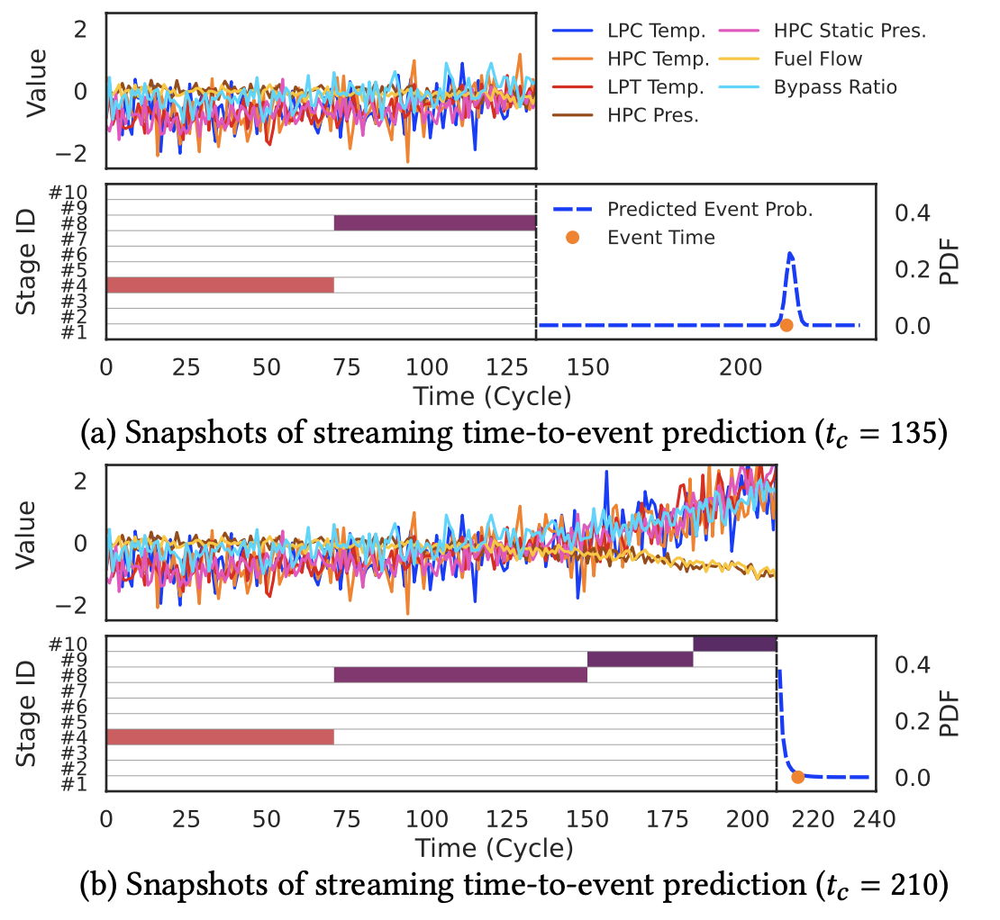
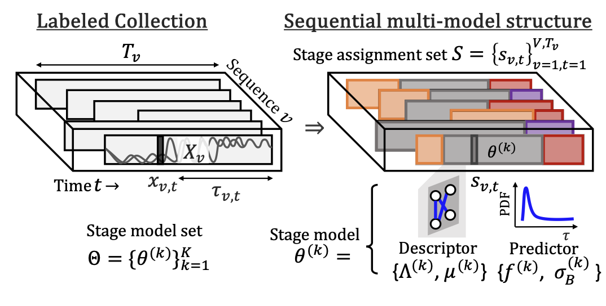

# TimeCast


[](https://arxiv.org/abs/2601.04741)
[](https://doi.org/10.145/3770854.3780164)
<!--  -->

Implementation of TimeCast.

Fast Mining and Dynamic Time-to-Event Prediction over
Multi-sensor Data Streams.\
Kota Nakamura, Koki Kawabata, Yasuko Matsubara, Yasushi Sakurai.\
The 32nd ACM SIGKDD Conference on Knowledge Discovery and Data Mining V.1 (KDD ’26).

|  |
|:--:|
| *Figure 1. Modeling power of TimeCast* |

---

## Abstract

**TimeCast** is a dynamic prediction framework for continuously forecasting the timing of future events (e.g., machine failure) by analyzing multi-sensor data streams. Given real-time sensor data streams obtained from machines, TimeCast continuously predicts when a machine failure will occur, adapting to the dynamic nature of real-world streams where underlying patterns evolve over time.

TimeCast has the following key properties:

- **(a) Dynamic** — it identifies distinct time-evolving patterns (i.e., *stages*) and learns individual models for each, enabling adaptive predictions based on pattern shifts.
- **(b) Practical** — it finds meaningful stages that capture time-varying interdependencies between multiple sensors, improving prediction performance.
- **(c) Scalable** — the algorithm scales linearly with input size and supports online model updates on data streams.

Extensive experiments on real datasets demonstrate that TimeCast provides higher prediction accuracy than state-of-the-art methods while detecting dynamic changes in data streams with a significant reduction in computational time.

---

## Method Overview
|  |
|:--:|
| *Figure 2. Overview of TimeCast* |


```
TimeCast
├── Descriptor    — Gaussian Graphical Model per stage
├── Predictor     — Wiener Process per stage
├── Optimization  — Alternating stage assignment & model fitting
└── Online Update — Adaptive stage generation at inference time
```

Given a labelled collection $\mathcal{D} = \{(X_{v,:t},\tau_{v,t})\}_{v,t=1}^{V,T_v} $,
TimeCast solves:

$$
\arg\max_{\Theta, S \nearrow_{t}}
\sum_{k=1}^{K}
\underbrace{\Psi_d\!\left(\mathcal{D} \mid \theta^{(k)}, S \right)}_{\text{Descriptor}}
+\,\beta
\underbrace{\Psi_p\!\left(\mathcal{D} \mid 
\theta^{(k)},S) \right)}_{\text{Predictor}}
$$

where $\theta^{(k)} \in \Theta$ is the model for stage $k$, $S$ denotes a set of stage assignments 
$s_{v,t}$, $\nearrow_{t}$ is a constraint of sequential connectivity, $K$ is the number of stages, and $\beta$ balances the Descriptor and Predictor objectives.

---

## Installation

> **Requires Python `>=3.9, <3.10`**

```bash
git clone https://github.com/<your-org>/TimeCast.git
cd TimeCast
poetry install --no-root && poetry shell
```

<details>
<summary>pip alternative</summary>

```bash
pip install numpy==1.23.4 pandas==1.5.1 scipy==1.9.3 scikit-learn==1.1.2 \
            tqdm matplotlib==3.5.3 seaborn dill more-itertools sklearn-pandas
```
</details>

---

## Quick Start

### Demo

```bash
sh _bin/demo.sh
```

### Usage

```python
import sys
sys.path.append("_src")
import utils
from timecast.TimeCast import TimeCast

# Prepare data (dict with "features" and "label" keys)
train_data, test_data = ...  # see utils.make_samples()

# Train
model = TimeCast(alpha=0.1, beta_w=0.1, k=15, max_iter=100)
train_time = model.tc_fit(train_data)

# Predict (static)
pred, cluster_ids, inc_stage_ids, fin_stage_ids, pred_time, _ = model.tc_scan(
    test_data, update=False
)

# Predict with online model update
pred, cluster_ids, inc_stage_ids, fin_stage_ids, pred_time, n_stage_hist = model.tc_scan(
    test_data, update=True
)
```

---

## Hyperparameters

| Argument | Default | Description |
|---|---|---|
| `--alpha` | `0.1` | L1 regularization strength for Graphical Lasso (MRF sparsity) |
| `--beta_w` | `0.1` | Weight for the Wiener process loss ($\lambda_{\text{Wiener}} = \beta_w$) |
| `--k` | `15` | Initial number of latent stages |
| `--niter` | `100` | Maximum number of alternating optimization iterations |
| `--window_size` | `20` | Sliding window size (time steps) |
| `--step_size` | `1` | Sliding window step size |
| `--split_ind` | `0` | K-fold split index (0 to k−1) |
| `--valid_ratio` | `0.1` | Ratio of training data held out for validation |

---

## Datasets

Please see [`_dat/README.md`](_dat/README.md) for detailed installation instructions.

| Dataset | Description | # Sensors | Included |
|---|---|---|---|
| **Engine** (CMAPSS, NASA) | Turbofan jet engine run-to-failure; subsets FD001 & FD003 used | 7 | ✅ |
| **Factory** (Azure PdM) | Industrial machine predictive maintenance with 4 sensor streams | 4 | ✅ |
| **ICU** (MIMIC-III) | ICU patient time-to-event; requires authorization from PhysioNet | 6 | ❌ |

For ICU datasets (*ICU-Chronic*, *ICU-Acute*, *ICU-Mixed*), follow the steps in `_dat/README.md` to obtain access and preprocess MIMIC-III data.

---

## Project Structure

```
TimeCast/
├── _assets/            # Figures for README
├── _bin/
│   └── demo.sh         # Demo run script
├── _dat/
│   ├── README.md       # Dataset installation instructions
│   ├── Engine/         # CMAPSS (NASA Turbofan) dataset loader
│   │   ├── __init__.py
│   │   └── README.md
│   └── Factory/        # Azure PdM dataset loader
│       └── __init__.py
├── _src/
│   ├── utils.py        # Data loading, preprocessing, evaluation utilities
│   └── timecast/
│       ├── TimeCast.py          # Main model class
│       ├── wiener.py            # Wiener process degradation model
│       ├── graphical_lasso.py   # MRF / Graphical Lasso implementation
│       └── main.py              # CLI entry point
└── pyproject.toml
```

---

## Citation
🚧 Under construction.
<!-- If you use this code in your research, please cite:

```bibtex
@inproceedings{timecast,
  title     = {Fast Mining and Dynamic Time-to-Event Prediction over Multi-sensor Data Streams},
  author    = {},
  booktitle = {},
  year      = {}
} -->
```
